Yes! Here's the diagram extracted as a Mermaid flowchart:

```mermaid
flowchart TD
    %% Information Sources
    Market[📊 Market<br/>Yahoo Finance<br/>Trading Charts]
    Social[🐦 Social Media<br/>X/Twitter<br/>Reddit<br/>EODHD APIs]
    News[📰 News<br/>Bloomberg<br/>FinHub<br/>Reuters<br/>Reddit]
    Fundamentals[📈 Fundamentals<br/>Company Profile<br/>Financial History<br/>Insider Transactions]
    
    %% Central Processing
    ResearchTeam[👥 Researcher Team]
    
    %% Sentiment Analysis
    Bullish[📈 Bullish]
    Bearish[📉 Bearish]
    Discussion[💬 Discussion]
    
    %% Evidence Generation
    BuyEvidence[✅ Buy Evidence]
    SellEvidence[❌ Sell Evidence]
    
    %% Trading Decision
    Trader[👤 Trader]
    TransactionProposal[📋 Transaction Proposal]
    
    %% Risk Management
    RiskTeam[⚖️ Risk Management Team]
    Aggressive[🔴 Aggressive]
    Neutral[🟡 Neutral]
    Conservative[🔵 Conservative]
    
    %% AI and Management
    OpenAI[🤖 OpenAI o1 Deep Thinking]
    Manager[👔 Manager]
    TeamOverview[👥 Team Overview<br/>Analyst: Risk/Reward<br/>Researcher: Strategy<br/>Trader: Execution<br/>Risk Team: Risk Exposure<br/>Manager: Authorization]
    
    %% Final Decision
    Decision[⚡ Decision]
    Execution[💰 Execution]
    
    %% Flow Connections
    Market --> ResearchTeam
    Social --> ResearchTeam
    News --> ResearchTeam
    Fundamentals --> ResearchTeam
    
    ResearchTeam --> Bullish
    ResearchTeam --> Bearish
    
    Bullish <--> Discussion
    Bearish <--> Discussion
    
    Bullish --> BuyEvidence
    Bearish --> SellEvidence
    
    BuyEvidence --> Trader
    SellEvidence --> Trader
    
    Trader --> TransactionProposal
    TransactionProposal --> RiskTeam
    
    RiskTeam --> Aggressive
    RiskTeam --> Neutral
    RiskTeam --> Conservative
    
    OpenAI --> TeamOverview
    RiskTeam --> Manager
    Manager --> TeamOverview
    
    TeamOverview --> Decision
    Decision --> Execution
    
    %% Styling
    classDef sourceNode fill:#f9f9b7
    classDef processNode fill:#d4edda
    classDef sentimentNode fill:#f8d7da
    classDef evidenceNode fill:#e2e3f0
    classDef riskNode fill:#fff3cd
    classDef finalNode fill:#6c9bd1
    
    class Market,Social,News,Fundamentals sourceNode
    class ResearchTeam,Trader processNode
    class Bullish,Bearish,Discussion sentimentNode
    class BuyEvidence,SellEvidence evidenceNode
    class RiskTeam,Aggressive,Neutral,Conservative,Manager riskNode
    class Decision,Execution finalNode
```

This Mermaid diagram captures:
- **Information flow** from multiple sources (Market, Social Media, News, Fundamentals)
- **Research and sentiment analysis** (Bullish/Bearish with discussion)
- **Evidence generation** (Buy/Sell evidence)
- **Risk management** with different approaches (Aggressive, Neutral, Conservative)
- **AI integration** (OpenAI o1 Deep Thinking)
- **Final decision and execution** process

The diagram maintains the logical flow and relationships shown in the original image while being rendered as a clean, structured Mermaid flowchart.