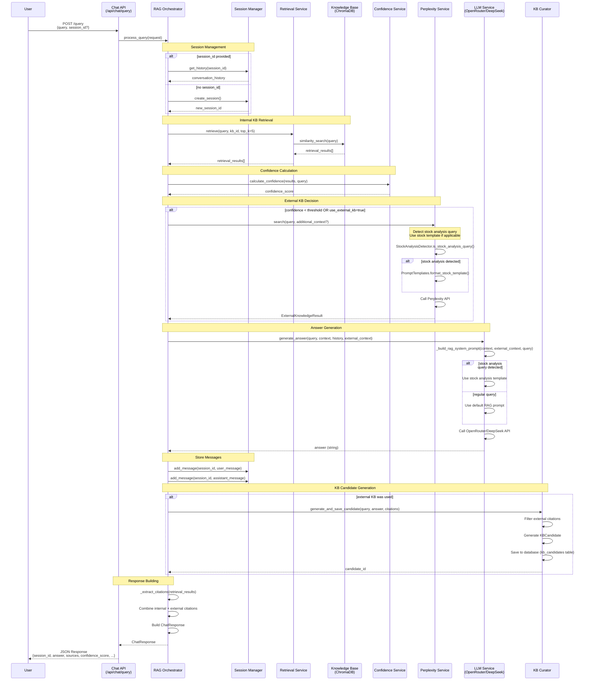
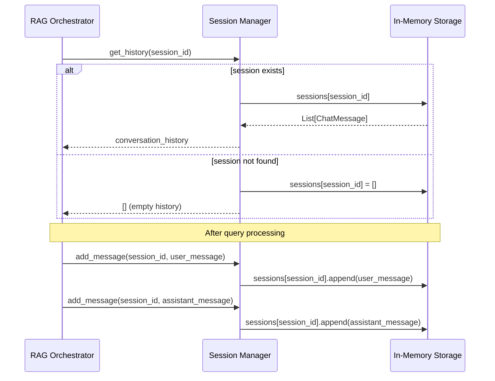
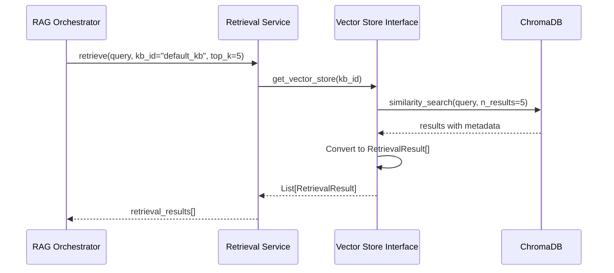
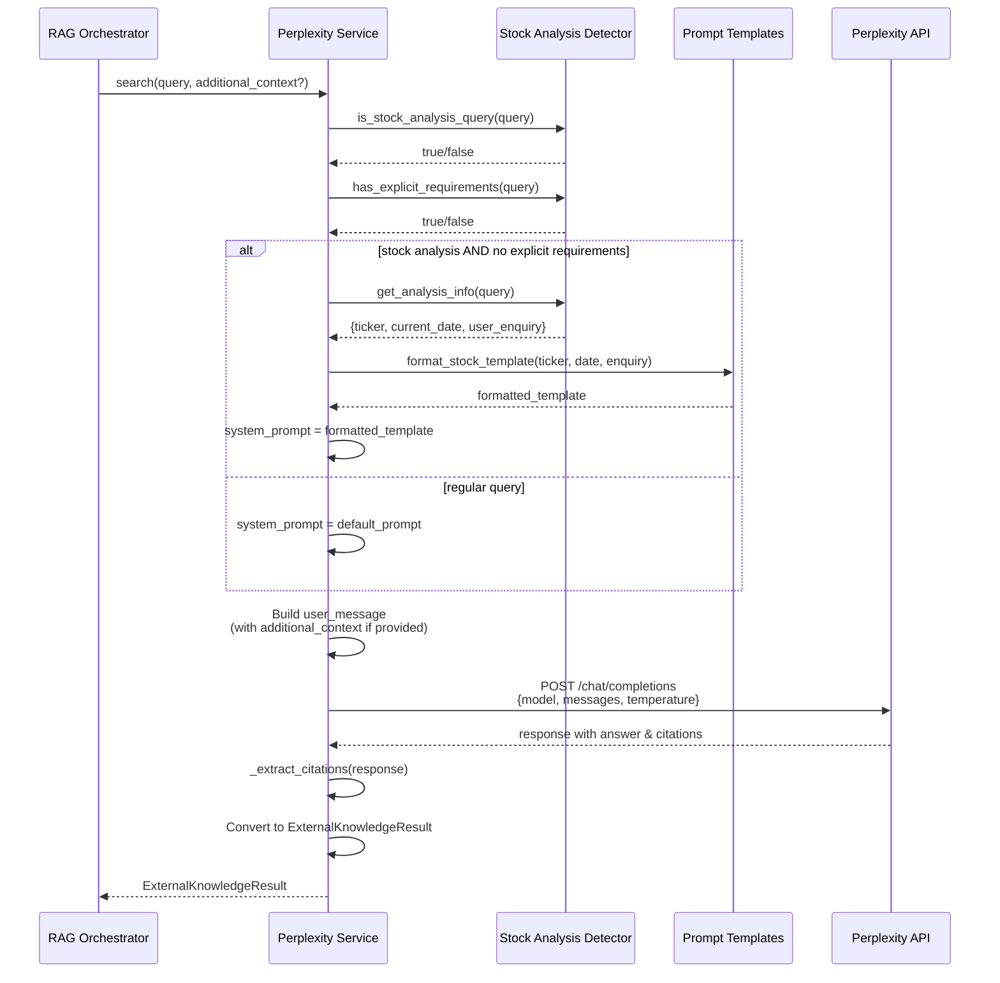
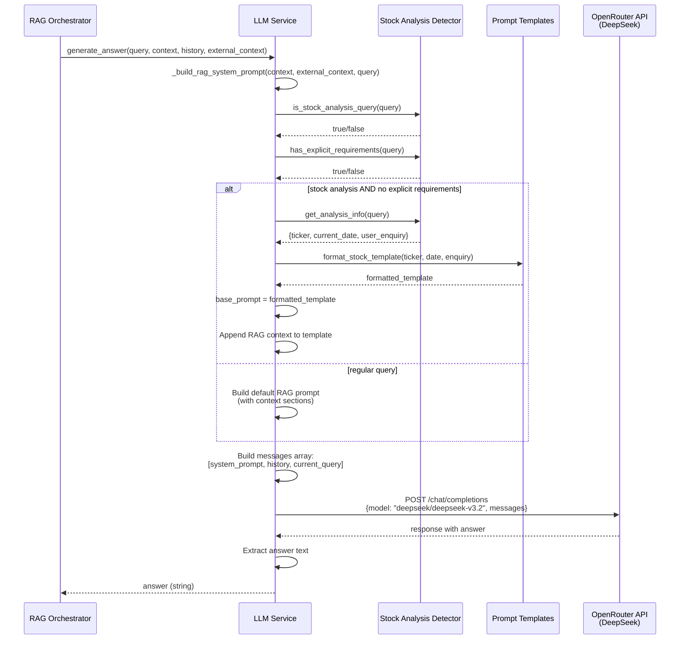
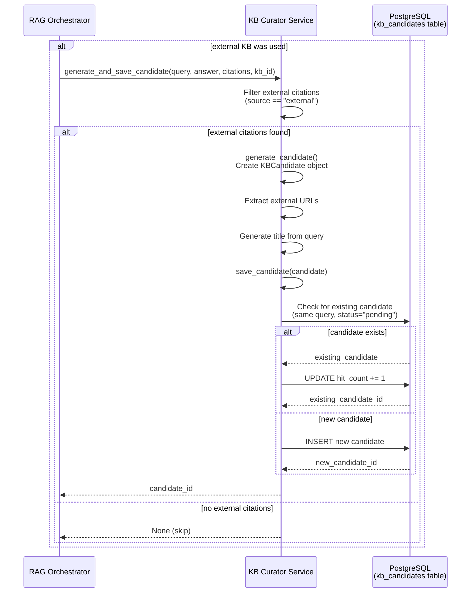
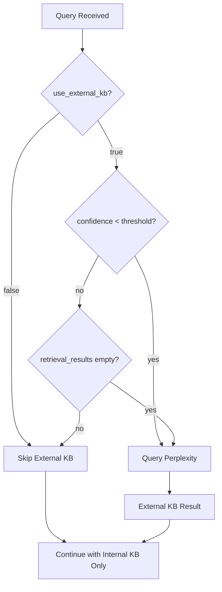
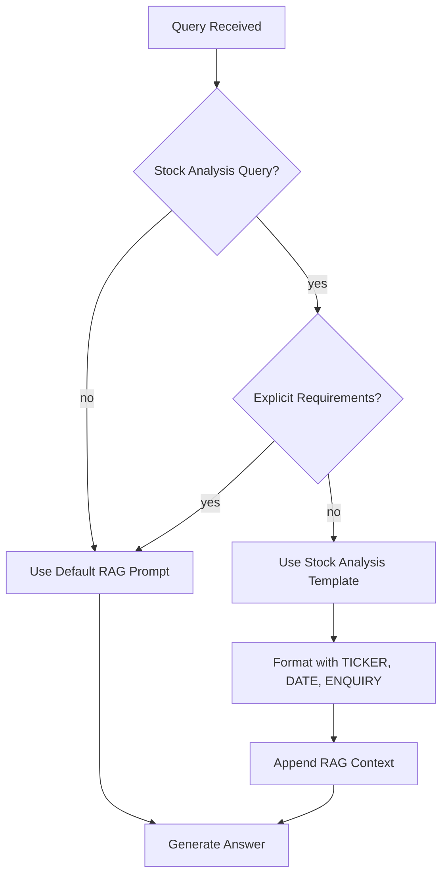
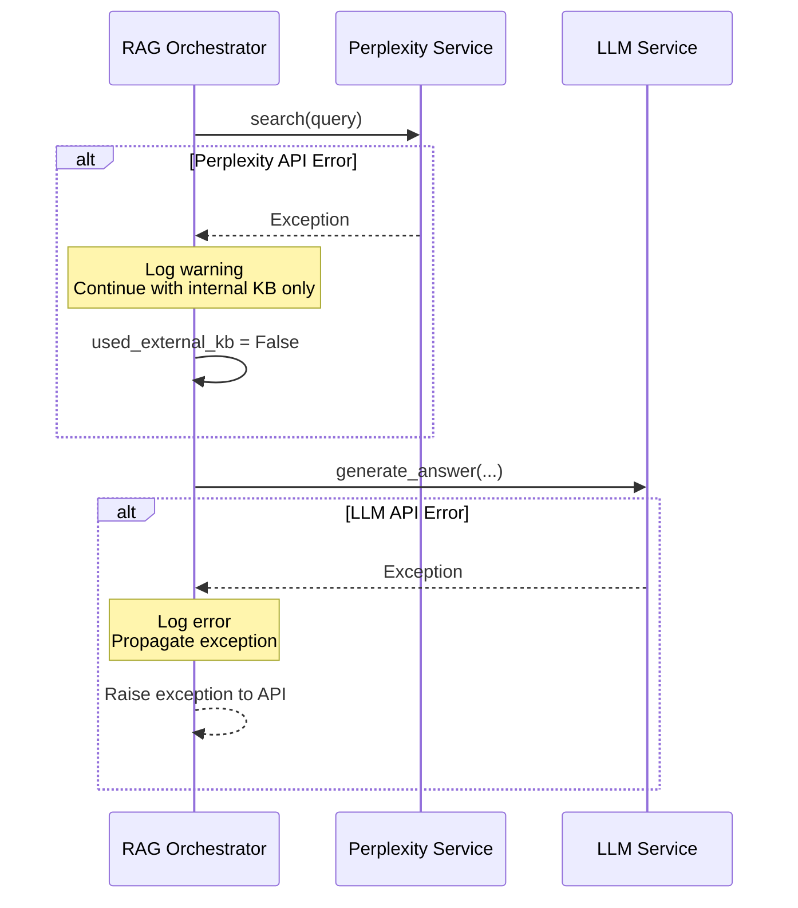

# RAG System Sequence Diagram

This document illustrates the interaction flow between the Chat API, Knowledge Base (KB), and Perplexity services in the Agentic AI Knowledge Base System.

## Main Query Flow

## Detailed Component Interactions

### 1. Session Management Flow

### 2. Knowledge Base Retrieval Flow

### 3. External Knowledge (Perplexity) Flow

### 4. LLM Answer Generation Flow

### 5. KB Candidate Generation Flow

## Key Decision Points

### Decision 1: External KB Query

### Decision 2: Stock Analysis Template

## Error Handling Flow

## Data Flow Summary

1. **User Query** → Chat API
2. **Session Management** → Retrieve/Create session, get history
3. **Internal KB Retrieval** → ChromaDB similarity search
4. **Confidence Calculation** → Based on retrieval results
5. **External KB Decision** → Query Perplexity if needed
6. **Stock Analysis Detection** → Apply template if applicable
7. **LLM Generation** → Generate answer with context
8. **Citation Extraction** → Combine internal + external citations
9. **Session Update** → Store user & assistant messages
10. **Candidate Generation** → Create KB candidate if external KB used
11. **Response Building** → Return ChatResponse with all metadata

## Notes

- **Session ID**: Maintains conversation context across queries
- **Confidence Threshold**: Configurable via `KB_CONFIDENCE_THRESHOLD` setting
- **Stock Analysis**: Automatically detected and uses professional template
- **Citations**: Separated from answer text (sources in response, not in answer)
- **Error Handling**: Graceful fallback to internal KB if external fails
- **KB Candidates**: Automatically generated when external knowledge is used
