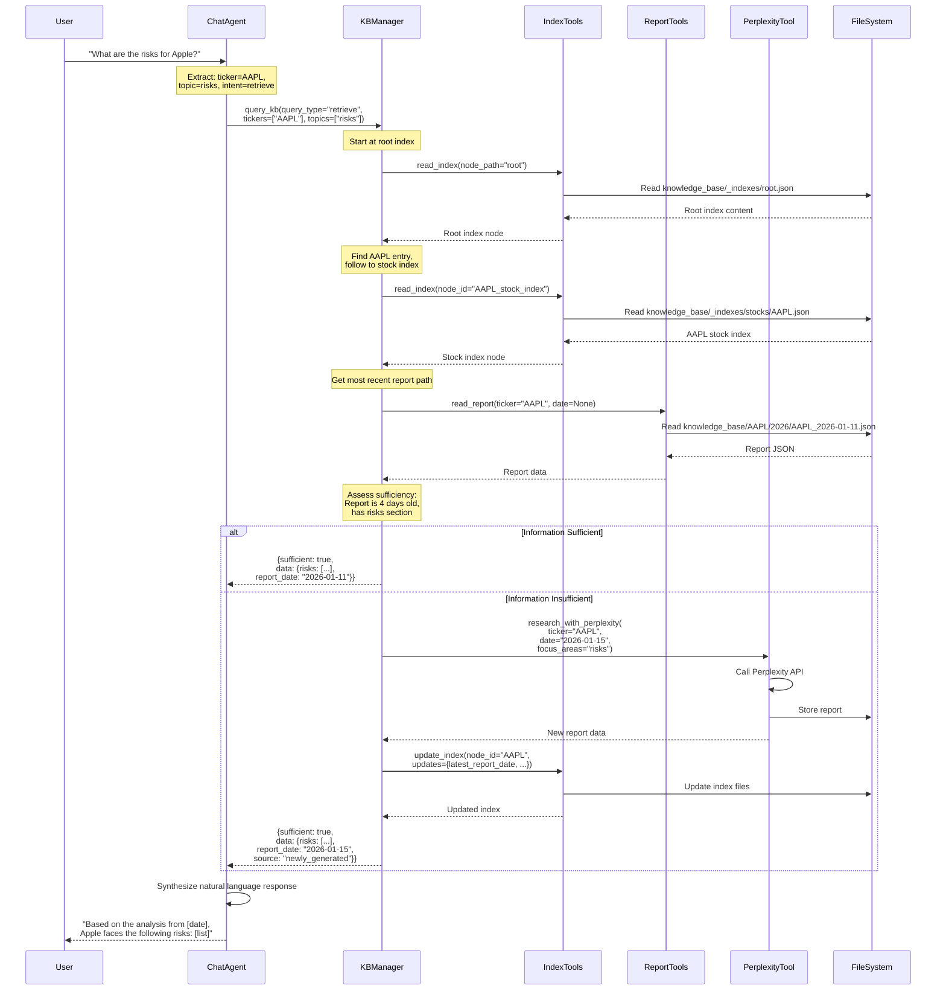

# Product Requirements Document: Layered Agent Stock Analysis System

## Existing Design Assessment

### 1. Codebase Overview

**Current Project Structure:**
- **Location**: `stock-analysis-report/` directory
- **Main Module**: `stock_analyzer.py` - Single monolithic class `StockAnalysisGenerator`
- **Knowledge Base**: Flat file structure `knowledge_base/{ticker}/{year}/{ticker}_{date}.json`
- **Storage Format**: JSON files with complete analysis reports
- **API Integration**: Direct Perplexity API calls via SDK or OpenAI compatibility mode
- **Interface**: CLI-only (argparse-based commands)

**Key Components:**
- `StockAnalysisGenerator`: Handles API calls, report generation, and file I/O
- Knowledge base directory structure: `{ticker}/{year}/` hierarchy
- Report schema: Comprehensive JSON with 10 top-level fields (meta, price_snapshot, executive_summary, etc.)

### 2. Domain & Architecture Analysis

**Current Architecture:**
- **Monolithic Design**: Single class handles all responsibilities
- **Direct API Integration**: No abstraction layer between business logic and external API
- **File-based Storage**: Simple directory structure with no indexing or search capabilities
- **No Agent Framework**: Procedural code, not agent-based architecture

**Core Domains Identified:**
1. **Report Generation Domain**: Perplexity API interaction, prompt management, response parsing
2. **Storage Domain**: File I/O, path management, report retrieval
3. **CLI Domain**: User interaction, argument parsing, command routing

**Responsibilities:**
- `StockAnalysisGenerator` owns: API client, prompt loading, report generation, file storage, report loading, listing
- No separation of concerns between API client, business logic, and storage

### 3. Design Quality Evaluation

**Cohesion & Coupling:**
- ❌ **Low Cohesion**: Single class handles API calls, data transformation, storage, and CLI
- ❌ **Tight Coupling**: Direct file system access, no abstraction for storage layer
- ❌ **No Dependency Injection**: Hard-coded dependencies (Perplexity client, file paths)

**Naming & Clarity:**
- ✅ **Good**: Class and method names are clear and descriptive
- ⚠️ **Mixed**: Some methods mix concerns (e.g., `_generate_non_streaming` handles both API call and JSON parsing)

**Layering:**
- ❌ **No Layering**: All logic in single class
- ❌ **No Presentation Layer**: CLI mixed with business logic
- ❌ **No Domain Layer**: Business rules embedded in procedural code
- ❌ **No Infrastructure Abstraction**: Direct file system and API calls

**API & Data Models:**
- ✅ **Good**: Well-defined JSON schema for reports
- ⚠️ **Limited**: No versioning, no validation beyond JSON parsing
- ❌ **No Query Interface**: Only exact match retrieval by ticker + date

**Error Handling & Observability:**
- ⚠️ **Basic**: Try-catch blocks with print statements
- ❌ **No Logging**: No structured logging framework
- ❌ **No Metrics**: No tracking of API usage, cache hits, etc.
- ⚠️ **Partial**: Error handling for API errors but not for file I/O failures

### 4. Design Issues & Code Smells

**God Class:**
- `StockAnalysisGenerator` has 8+ methods handling diverse responsibilities

**Anemic Domain Model:**
- Report data is just a dictionary, no domain objects or business logic encapsulation

**Tight Coupling:**
- Direct dependency on Perplexity SDK/OpenAI client
- Hard-coded file paths and directory structure
- No interface abstractions

**Poor Testability:**
- Cannot mock API calls or file system
- No dependency injection
- Business logic tightly coupled to I/O

**No Search/Index Capabilities:**
- Only exact match retrieval
- No semantic search
- No cross-ticker queries
- No topic-based retrieval

**No Agent Architecture:**
- Procedural code, not agent-based
- No tool/function calling framework
- No reasoning or decision-making layer

### 5. Improvement Recommendations

**Immediate Refactoring Needs:**
1. **Separate Concerns**: Split into API client, storage service, and business logic layers
2. **Introduce Interfaces**: Abstract API client and storage for testability
3. **Add Logging**: Replace print statements with structured logging
4. **Error Handling**: Comprehensive error handling with proper exception types

**Architecture Transformation:**
1. **Agent Framework**: Implement layered agent architecture with tool calling
2. **Knowledge Base Manager**: Separate agent for KB operations with graph-based indexing
3. **Chat Interface**: Conversational agent layer for user interaction
4. **Index System**: Graph-based index structure for semantic navigation
5. **Tool Abstraction**: Perplexity as a tool, not direct dependency

**Scalability Improvements:**
1. **Indexing Layer**: Multi-level index system for fast retrieval
2. **Caching Strategy**: Cache frequently accessed reports and index nodes
3. **Async Operations**: Support async API calls and file I/O
4. **Batch Operations**: Support bulk report generation and indexing

---

## Product Requirements Document

### 1. Overview

**Feature Objective:**
Transform the existing CLI-based stock analysis tool into a layered agent application that provides an intelligent chat interface for stock inquiries, powered by a graph-based knowledge base with dynamic indexing capabilities.

**Background and Problem Context:**
The current system is a simple CLI tool that generates stock analysis reports via Perplexity API and stores them in a flat file structure. Users must know exact ticker symbols and dates to retrieve information. There is no:
- Conversational interface for natural language queries
- Intelligent search across the knowledge base
- Relationship mapping between stocks, topics, and reports
- Dynamic index management for improved retrieval
- Agent-based reasoning for query understanding and information synthesis

**Why This Feature is Needed Now:**
- **User Experience**: Natural language queries are more intuitive than CLI commands
- **Knowledge Discovery**: Users need to explore relationships between stocks, sectors, and topics
- **Scalability**: As the knowledge base grows, flat file structure becomes inefficient
- **Intelligence**: Agent-based architecture enables reasoning about information gaps and when to fetch new data
- **Extensibility**: Layered design allows future enhancements (multi-modal, real-time data, etc.)

### 2. Goals & Non-Goals

#### Goals

1. **Conversational Interface**
   - Users can ask natural language questions about stocks
   - System understands stock tickers, dates, topics, and comparative queries
   - Responses are contextual and synthesized from knowledge base

2. **Intelligent Knowledge Base Management**
   - Graph-based index system for semantic navigation
   - Multi-level indexes (root → topic → stock → date)
   - Dynamic index updates based on new information

3. **Agent-Based Architecture**
   - Two-layer agent system: Chat Agent (outer) and KB Manager Agent (inner)
   - Agents use tool calling for inter-layer communication
   - Agents can reason about information sufficiency

4. **Perplexity Integration as Tool**
   - KB Manager can call Perplexity when information is insufficient
   - Raw responses stored with automatic index updates
   - Cost-aware decision making (check KB first, then API)

5. **File-Based Knowledge Base**
   - Maintain current file-based storage (no database required)
   - Preserve existing report structure and format
   - Support incremental migration from flat to indexed structure

#### Non-Goals

1. **Database Migration**: Not replacing file system with database (Phase 1)
2. **Real-Time Data**: Not fetching live market data (only stored reports)
3. **Multi-User Support**: Single-user system (no authentication/authorization)
4. **Web Interface**: CLI/chat interface only (no web UI)
5. **Vector Embeddings**: Not implementing semantic embeddings (Phase 1)
6. **Report Generation UI**: Not building UI for report creation (CLI remains)

### 3. User Stories / Use Cases

#### Primary User Persona
**Financial Analyst / Investor**: Needs quick access to stock analysis information, wants to explore relationships between stocks and topics, prefers natural language interaction.

#### Use Cases

**UC1: Natural Language Stock Query**
- **As a** user
- **I want to** ask "What's the latest analysis on Apple?"
- **So that** I can get information without knowing exact ticker or date format
- **Acceptance**: System identifies AAPL, finds most recent report, returns summary

**UC2: Topic-Based Exploration**
- **As a** user
- **I want to** ask "Show me all tech stocks with AI focus"
- **So that** I can discover related stocks and analyses
- **Acceptance**: System navigates index graph, finds relevant stocks, returns list

**UC3: Comparative Analysis**
- **As a** user
- **I want to** ask "Compare Apple and Microsoft's valuation"
- **So that** I can understand relative positioning
- **Acceptance**: System retrieves both reports, extracts valuation sections, provides comparison

**UC4: Information Gap Handling**
- **As a** user
- **I want to** ask "What's the risk analysis for Tesla?"
- **So that** I can get current risk information
- **Acceptance**: If KB lacks recent data, system calls Perplexity, stores result, updates index, returns answer

**UC5: Index Navigation**
- **As a** user (implicit)
- **I want the** KB Manager to navigate index graph intelligently
- **So that** it finds relevant information efficiently
- **Acceptance**: Manager starts at root index, follows relevant paths, retrieves matching reports

**UC6: Index Self-Improvement**
- **As a** user (implicit)
- **I want the** KB Manager to update indexes after new data
- **So that** future searches are more efficient
- **Acceptance**: After Perplexity call, manager updates relevant index nodes with new information

### 4. Functional Requirements

#### FR1: Chat Agent Layer

**FR1.1: Natural Language Understanding**
- System MUST parse user queries to extract:
  - Stock ticker symbols (explicit or implicit from company names)
  - Dates or date ranges (explicit, relative like "latest", or default to today)
  - Topics or focus areas (e.g., "valuation", "risks", "AI strategy")
  - Query intent (retrieve, compare, explore, generate)

**FR1.2: Stock Ticker Identification**
- System MUST identify stock tickers from:
  - Explicit ticker symbols (AAPL, MSFT, HKEX:9988)
  - Company names (Apple, Microsoft, Tencent)
  - Common aliases (Big Tech, FAANG stocks)
- System MUST handle ambiguous cases by asking for clarification

**FR1.3: Tool Calling to KB Manager**
- Chat Agent MUST call KB Manager as a tool with structured parameters:
  - `query_type`: retrieve | search | compare | generate
  - `tickers`: array of identified tickers
  - `date_range`: optional date constraints
  - `topics`: optional topic filters
  - `user_query`: original query for context

**FR1.4: Response Synthesis**
- System MUST synthesize KB Manager results into natural language responses
- System MUST cite sources (report dates, tickers)
- System MUST indicate when information is from KB vs newly generated

#### FR2: Knowledge Base Manager Agent

**FR2.1: Index Graph Navigation**
- KB Manager MUST start queries at root index
- KB Manager MUST navigate index graph based on query parameters
- KB Manager MUST follow index links to relevant topic/stock/date nodes
- KB Manager MUST decide navigation path based on index summaries and metadata

**FR2.2: Report Retrieval**
- KB Manager MUST retrieve reports matching:
  - Ticker symbol (exact or normalized)
  - Date (exact match or most recent if not specified)
  - Topic filters (if specified)
- KB Manager MUST return structured data with report paths and excerpts

**FR2.3: Information Sufficiency Assessment**
- KB Manager MUST evaluate if retrieved information is sufficient for query
- KB Manager MUST consider:
  - Date recency (if query implies current information)
  - Topic coverage (if query asks for specific topics)
  - Data completeness (if report has null/empty fields)
- KB Manager MUST return `sufficient: true/false` with reasoning

**FR2.4: Perplexity Tool Integration**
- KB Manager MUST call Perplexity tool when information is insufficient
- KB Manager MUST pass:
  - Ticker symbol
  - Analysis date (default to today if not specified)
  - Focus areas (extracted from query)
  - Context from existing KB reports (if any)
- KB Manager MUST store raw Perplexity response in knowledge base
- KB Manager MUST trigger index update after new data ingestion

**FR2.5: Index Update Management**
- KB Manager MUST update indexes after new report ingestion:
  - Root index: Add/update stock entry
  - Topic indexes: Add/update relevant topic nodes
  - Stock indexes: Add/update date entries
  - Cross-references: Update related stock/topic links
- KB Manager MUST generate/update index summaries based on report content
- KB Manager MUST maintain index metadata (last_updated, file_count, etc.)

#### FR3: Knowledge Base Index System

**FR3.1: Graph-Based Index Structure**
- System MUST implement index as directed graph with:
  - **Root Index**: Entry point with overview of all stocks
  - **Topic Indexes**: Nodes for topics (sectors, themes, metrics)
  - **Stock Indexes**: Nodes for each stock with date entries
  - **Date Indexes**: Nodes for time-based organization
  - **Cross-Reference Links**: Bidirectional links between related nodes

**FR3.2: Index Node Schema**
Each index node MUST contain:
- `node_id`: Unique identifier
- `node_type`: root | topic | stock | date | cross_ref
- `summary`: Text summary of indexed content
- `related_files`: Array of file paths
- `file_descriptions`: Map of file path → description
- `child_nodes`: Array of child node IDs
- `parent_nodes`: Array of parent node IDs
- `metadata`: Last updated, file count, etc.

**FR3.3: Root Index**
- Root index MUST be located at `knowledge_base/_indexes/root.json`
- Root index MUST list all stocks with:
  - Ticker symbol
  - Company name
  - Most recent report date
  - Link to stock index node
  - Brief summary

**FR3.4: Topic Indexes**
- Topic indexes MUST be located at `knowledge_base/_indexes/topics/{topic_name}.json`
- Topics include: sectors (Technology, Finance), themes (AI, Cloud), metrics (Valuation, Risk)
- Each topic index MUST list:
  - Related stocks
  - Relevant report excerpts
  - Links to stock indexes
  - Cross-references to related topics

**FR3.5: Stock Indexes**
- Stock indexes MUST be located at `knowledge_base/_indexes/stocks/{ticker}.json`
- Each stock index MUST contain:
  - Company information
  - List of available reports (by date)
  - Links to topic indexes
  - Summary of latest analysis
  - Related stocks (competitors, sector peers)

**FR3.6: Index Persistence**
- Indexes MUST be stored as JSON files in `knowledge_base/_indexes/`
- Indexes MUST be human-readable for debugging
- Index updates MUST be atomic (write to temp file, then rename)

#### FR4: Knowledge Base Tools

**FR4.1: Index Read Tool**
- Tool name: `read_index`
- Parameters: `node_id` or `node_path`
- Returns: Index node content
- Used by: KB Manager to navigate index graph

**FR4.2: Index Search Tool**
- Tool name: `search_index`
- Parameters: `query_text`, `node_type` (optional), `max_results`
- Returns: Array of matching index nodes with relevance scores
- Used by: KB Manager to find relevant starting points

**FR4.3: Report Read Tool**
- Tool name: `read_report`
- Parameters: `ticker`, `date` (optional)
- Returns: Full report JSON or most recent if date not specified
- Used by: KB Manager to retrieve actual report content

**FR4.4: Report Search Tool**
- Tool name: `search_reports`
- Parameters: `tickers` (array), `date_range`, `topics`, `keywords`
- Returns: Array of matching reports with excerpts
- Used by: KB Manager for topic-based or comparative queries

**FR4.5: Index Update Tool**
- Tool name: `update_index`
- Parameters: `node_id`, `updates` (partial node data)
- Returns: Updated node
- Used by: KB Manager after new data ingestion

**FR4.6: Perplexity Research Tool**
- Tool name: `research_with_perplexity`
- Parameters: `ticker`, `date`, `focus_areas`, `context` (optional)
- Returns: Generated report (same format as existing reports)
- Used by: KB Manager when information is insufficient
- Side effects: Stores report, triggers index update

**FR4.7: Index Create Tool**
- Tool name: `create_index_node`
- Parameters: `node_type`, `node_data`
- Returns: Created node with generated ID
- Used by: KB Manager when new index nodes are needed

### 5. System Design & Flow

#### High-Level Architecture

```
┌─────────────────────────────────────────────────────────┐
│                    Chat Agent Layer                      │
│  - Natural Language Understanding                        │
│  - Ticker Identification                                 │
│  - Query Intent Classification                          │
│  - Response Synthesis                                    │
└──────────────────┬──────────────────────────────────────┘
                   │ Tool Call
                   │ (query_type, tickers, topics, etc.)
                   ▼
┌─────────────────────────────────────────────────────────┐
│              KB Manager Agent Layer                      │
│  - Index Graph Navigation                                │
│  - Information Sufficiency Assessment                    │
│  - Tool Orchestration                                    │
│  - Index Update Logic                                    │
└──────────────────┬──────────────────────────────────────┘
                   │ Tool Calls
                   ▼
┌─────────────────────────────────────────────────────────┐
│                  Knowledge Base Tools                    │
│  ┌──────────────┐  ┌──────────────┐  ┌──────────────┐  │
│  │ Index Tools  │  │ Report Tools │  │ Perplexity   │  │
│  │ - read_index │  │ - read_report│  │ - research   │  │
│  │ - search_idx │  │ - search_rpt │  │              │  │
│  │ - update_idx │  │              │  │              │  │
│  │ - create_idx │  │              │  │              │  │
│  └──────────────┘  └──────────────┘  └──────────────┘  │
└─────────────────────────────────────────────────────────┘
                   │
                   ▼
┌─────────────────────────────────────────────────────────┐
│              File-Based Knowledge Base                   │
│  knowledge_base/                                         │
│  ├── _indexes/          (Graph index structure)         │
│  │   ├── root.json                                      │
│  │   ├── topics/                                        │
│  │   ├── stocks/                                        │
│  │   └── dates/                                         │
│  ├── AAPL/              (Report storage)               │
│  │   └── 2026/                                          │
│  │       └── AAPL_2026-01-11.json                       │
│  └── MSFT/                                              │
│      └── 2026/                                           │
└─────────────────────────────────────────────────────────┘
```

#### Component Responsibilities

**Chat Agent:**
- Receives user queries in natural language
- Extracts entities (tickers, dates, topics)
- Classifies query intent
- Calls KB Manager tool with structured parameters
- Synthesizes KB Manager response into natural language
- Handles clarification requests

**KB Manager Agent:**
- Receives structured query from Chat Agent
- Navigates index graph starting from root
- Decides which indexes to read based on query
- Retrieves relevant reports using report tools
- Assesses information sufficiency
- Calls Perplexity tool if needed
- Updates indexes after new data
- Returns structured results to Chat Agent

**Knowledge Base Tools:**
- **Index Tools**: CRUD operations on index graph nodes
- **Report Tools**: Read and search operations on report files
- **Perplexity Tool**: External API integration for report generation

#### Data Flow

1. **User Query → Chat Agent**
   - User: "What are the risks for Apple?"
   - Chat Agent extracts: ticker=AAPL, topic=risks, intent=retrieve

2. **Chat Agent → KB Manager**
   - Tool call: `query_kb(query_type="retrieve", tickers=["AAPL"], topics=["risks"])`

3. **KB Manager → Index Navigation**
   - Reads root index
   - Finds AAPL entry, follows link to AAPL stock index
   - Reads AAPL stock index, finds most recent report date
   - Identifies report path

4. **KB Manager → Report Retrieval**
   - Calls `read_report(ticker="AAPL", date=None)` → gets most recent
   - Extracts risks section from report
   - Assesses sufficiency: ✅ sufficient (report is recent, has risks data)

5. **KB Manager → Chat Agent**
   - Returns: `{sufficient: true, data: {risks: [...], report_date: "2026-01-11"}}`

6. **Chat Agent → User**
   - Synthesizes: "Based on the analysis from January 11, 2026, Apple faces the following risks: [list]"

**Alternative Flow (Information Insufficient):**

3. **KB Manager → Information Assessment**
   - Finds report but it's 6 months old
   - Assesses sufficiency: ❌ insufficient (query implies current information)

4. **KB Manager → Perplexity Tool**
   - Calls `research_with_perplexity(ticker="AAPL", date="2026-01-15", focus_areas="risks")`
   - Perplexity generates new report
   - Tool stores report in `knowledge_base/AAPL/2026/AAPL_2026-01-15.json`

5. **KB Manager → Index Update**
   - Calls `update_index(node_id="AAPL", updates={latest_report_date: "2026-01-15", ...})`
   - Updates root index, AAPL stock index, risk topic index

6. **KB Manager → Chat Agent**
   - Returns: `{sufficient: true, data: {risks: [...], report_date: "2026-01-15", source: "newly_generated"}}`

### 6. Sequence Diagram



### 7. Open Questions & Risks

#### Open Questions

1. **Agent Framework Selection**
   - **Question**: Which agent framework to use? (LangChain, LlamaIndex, custom)
   - **Impact**: Affects development speed, tool integration, and extensibility
   - **Recommendation**: Evaluate LangChain for tool calling, LlamaIndex for KB management

2. **Index Update Strategy**
   - **Question**: Should index updates be synchronous or asynchronous?
   - **Impact**: User experience (blocking vs non-blocking) and system complexity
   - **Recommendation**: Start synchronous, add async queue later if needed

3. **Index Graph Complexity**
   - **Question**: How deep should the index graph be? (2-level vs 3-level vs N-level)
   - **Impact**: Navigation complexity, update overhead, search performance
   - **Recommendation**: Start with 3-level (root → topic/stock → date), iterate based on usage

4. **Perplexity Cost Management**
   - **Question**: Should there be a cost threshold or rate limiting for Perplexity calls?
   - **Impact**: API costs and user experience
   - **Recommendation**: Add configurable thresholds and user warnings

5. **Index Summary Generation**
   - **Question**: How should index summaries be generated? (LLM-based vs rule-based)
   - **Impact**: Index quality, update cost, maintenance complexity
   - **Recommendation**: Start rule-based (extract key fields), add LLM summarization later

6. **Query Ambiguity Handling**
   - **Question**: How should ambiguous queries be handled? (e.g., "Apple" could be AAPL or company name)
   - **Impact**: User experience and system accuracy
   - **Recommendation**: Use context (previous queries, index data) and ask for clarification if needed

#### Risks

1. **Technical Risks**

   **Risk**: Index graph becomes too complex to navigate efficiently
   - **Mitigation**: Start simple, add complexity incrementally; implement index caching
   - **Monitoring**: Track navigation depth and time-to-result metrics

   **Risk**: File system performance degrades with large knowledge base
   - **Mitigation**: Implement file caching, consider database migration in Phase 2
   - **Monitoring**: Monitor file I/O latency and knowledge base size

   **Risk**: Perplexity API rate limits or failures
   - **Mitigation**: Implement retry logic, fallback to cached data, queue requests
   - **Monitoring**: Track API success rate and rate limit hits

2. **Product Risks**

   **Risk**: Users expect real-time data but system only has stored reports
   - **Mitigation**: Clear documentation, indicate report dates in responses
   - **Monitoring**: Track user queries asking for "current" information

   **Risk**: Index updates fail silently, leading to stale indexes
   - **Mitigation**: Implement index validation, periodic index rebuild, error logging
   - **Monitoring**: Track index update success rate and index freshness

3. **Delivery Risks**

   **Risk**: Agent framework learning curve delays development
   - **Mitigation**: Prototype early, choose well-documented framework, allocate learning time
   - **Monitoring**: Track development velocity and blocker resolution time

   **Risk**: Scope creep from adding too many features
   - **Mitigation**: Strict adherence to non-goals, phased delivery, MVP first
   - **Monitoring**: Regular scope reviews and feature prioritization

4. **Scaling Risks**

   **Risk**: Knowledge base grows beyond file system efficiency
   - **Mitigation**: Plan for database migration in Phase 2, implement pagination
   - **Monitoring**: Track knowledge base size and query performance

   **Risk**: Index graph becomes unmaintainable
   - **Mitigation**: Automated index validation, periodic graph optimization, clear index schema
   - **Monitoring**: Track index complexity metrics and maintenance time

---

## Implementation Phases

### Phase 1: MVP (Minimum Viable Product)
- Basic chat interface with ticker identification
- Simple KB Manager with root index only
- Basic report retrieval
- Perplexity integration as tool
- Manual index updates

### Phase 2: Enhanced Indexing
- Full graph-based index system
- Topic and stock indexes
- Automatic index updates
- Index navigation logic

### Phase 3: Advanced Features
- Comparative queries
- Topic-based exploration
- Index optimization
- Performance improvements

---

## Success Metrics

1. **Query Success Rate**: % of user queries successfully answered (target: >90%)
2. **KB Hit Rate**: % of queries answered from KB without Perplexity call (target: >70%)
3. **Response Time**: Average time from query to response (target: <5s for KB hits, <30s for Perplexity)
4. **Index Freshness**: Average age of index nodes (target: <7 days)
5. **User Satisfaction**: Qualitative feedback on response quality and relevance

---

## Appendix: Index Schema Examples

### Root Index Example
```json
{
  "node_id": "root",
  "node_type": "root",
  "summary": "Knowledge base containing stock analysis reports for 15 stocks across Technology, Finance, and Consumer sectors.",
  "last_updated": "2026-01-15T10:00:00Z",
  "stock_count": 15,
  "stocks": [
    {
      "ticker": "AAPL",
      "company_name": "Apple Inc.",
      "latest_report_date": "2026-01-11",
      "stock_index_id": "AAPL_stock_index",
      "summary": "Technology company focused on consumer hardware and services."
    }
  ],
  "topics": [
    {
      "topic_name": "Technology",
      "topic_index_id": "topic_technology",
      "stock_count": 8
    }
  ]
}
```

### Stock Index Example
```json
{
  "node_id": "AAPL_stock_index",
  "node_type": "stock",
  "ticker": "AAPL",
  "company_name": "Apple Inc.",
  "summary": "Latest analysis from 2026-01-11: Strong ecosystem moat, premium valuation, focus on services growth.",
  "latest_report_date": "2026-01-11",
  "reports": [
    {
      "date": "2026-01-11",
      "file_path": "AAPL/2026/AAPL_2026-01-11.json",
      "summary": "Comprehensive analysis covering valuation, risks, and catalysts."
    }
  ],
  "related_topics": ["topic_technology", "topic_consumer_electronics"],
  "related_stocks": ["MSFT", "GOOGL"],
  "last_updated": "2026-01-11T19:07:41Z"
}
```

### Topic Index Example
```json
{
  "node_id": "topic_technology",
  "node_type": "topic",
  "topic_name": "Technology",
  "summary": "Technology sector stocks including hardware, software, and cloud services companies.",
  "related_stocks": ["AAPL", "MSFT", "GOOGL", "NVDA"],
  "stock_indexes": [
    {"ticker": "AAPL", "index_id": "AAPL_stock_index"},
    {"ticker": "MSFT", "index_id": "MSFT_stock_index"},
    {"ticker": "GOOGL", "index_id": "GOOGL_stock_index"},
    {"ticker": "NVDA", "index_id": "NVDA_stock_index"}
  ],
  "related_topics": ["topic_ai", "topic_cloud_computing", "topic_semiconductors"],
  "report_excerpts": [
    {
      "ticker": "AAPL",
      "date": "2026-01-11",
      "excerpt": "Technology company focused on consumer hardware and services with strong ecosystem moat.",
      "file_path": "AAPL/2026/AAPL_2026-01-11.json"
    }
  ],
  "last_updated": "2026-01-15T10:00:00Z",
  "report_count": 12
}
```

### Date Index Example
```json
{
  "node_id": "date_2026_01",
  "node_type": "date",
  "date_range": "2026-01",
  "summary": "Reports generated in January 2026 covering 8 stocks across multiple sectors.",
  "reports": [
    {
      "ticker": "AAPL",
      "date": "2026-01-11",
      "file_path": "AAPL/2026/AAPL_2026-01-11.json",
      "summary": "Comprehensive analysis covering valuation, risks, and catalysts."
    },
    {
      "ticker": "MSFT",
      "date": "2026-01-12",
      "file_path": "MSFT/2026/MSFT_2026-01-12.json",
      "summary": "Focus on cloud growth and AI monetization."
    }
  ],
  "stock_count": 8,
  "last_updated": "2026-01-15T10:00:00Z"
}
```

### Cross-Reference Index Example
```json
{
  "node_id": "crossref_aapl_msft",
  "node_type": "cross_ref",
  "source_node_id": "AAPL_stock_index",
  "target_node_id": "MSFT_stock_index",
  "relationship_type": "competitor",
  "summary": "Apple and Microsoft are competitors in personal computing and cloud services.",
  "evidence": [
    {
      "file_path": "AAPL/2026/AAPL_2026-01-11.json",
      "excerpt": "Key competitor Microsoft in personal computing and cloud services."
    },
    {
      "file_path": "MSFT/2026/MSFT_2026-01-12.json",
      "excerpt": "Competes with Apple in consumer hardware and ecosystem services."
    }
  ],
  "strength": 0.85,
  "last_updated": "2026-01-15T10:00:00Z"
}
```

---

## Appendix B: Tool Specifications

### Tool: query_kb (KB Manager Tool)

**Description**: Main tool for Chat Agent to query the knowledge base through KB Manager.

**Parameters**:
```json
{
  "query_type": "retrieve" | "search" | "compare" | "generate",
  "tickers": ["AAPL", "MSFT"],
  "date_range": {
    "start": "2026-01-01",
    "end": "2026-01-15"
  },
  "topics": ["risks", "valuation"],
  "user_query": "What are the risks for Apple?",
  "context": {
    "previous_queries": [],
    "conversation_history": []
  }
}
```

**Returns**:
```json
{
  "sufficient": true,
  "data": {
    "risks": [...],
    "report_date": "2026-01-11",
    "source": "knowledge_base" | "newly_generated",
    "report_path": "AAPL/2026/AAPL_2026-01-11.json"
  },
  "reasoning": "Found recent report with comprehensive risks section.",
  "index_nodes_visited": ["root", "AAPL_stock_index"]
}
```

### Tool: read_index

**Description**: Read an index node from the knowledge base.

**Parameters**:
```json
{
  "node_id": "AAPL_stock_index",
  "node_path": "stocks/AAPL.json"
}
```

**Returns**: Index node JSON (see Index Schema Examples)

### Tool: search_index

**Description**: Search index nodes by text query.

**Parameters**:
```json
{
  "query_text": "technology stocks with AI focus",
  "node_type": "topic" | "stock" | null,
  "max_results": 10
}
```

**Returns**:
```json
{
  "results": [
    {
      "node_id": "topic_ai",
      "node_type": "topic",
      "relevance_score": 0.92,
      "summary": "..."
    }
  ]
}
```

### Tool: read_report

**Description**: Read a stock analysis report.

**Parameters**:
```json
{
  "ticker": "AAPL",
  "date": "2026-01-11"
}
```

**Returns**: Full report JSON (existing report format)

### Tool: search_reports

**Description**: Search across multiple reports.

**Parameters**:
```json
{
  "tickers": ["AAPL", "MSFT"],
  "date_range": {
    "start": "2026-01-01",
    "end": "2026-01-15"
  },
  "topics": ["risks", "valuation"],
  "keywords": ["AI", "cloud"]
}
```

**Returns**:
```json
{
  "results": [
    {
      "ticker": "AAPL",
      "date": "2026-01-11",
      "file_path": "AAPL/2026/AAPL_2026-01-11.json",
      "excerpt": "...",
      "relevance_score": 0.88
    }
  ]
}
```

### Tool: update_index

**Description**: Update an existing index node.

**Parameters**:
```json
{
  "node_id": "AAPL_stock_index",
  "updates": {
    "latest_report_date": "2026-01-15",
    "summary": "Updated summary...",
    "reports": [...]
  }
}
```

**Returns**: Updated index node

### Tool: create_index_node

**Description**: Create a new index node.

**Parameters**:
```json
{
  "node_type": "topic" | "stock" | "date" | "cross_ref",
  "node_data": {
    "topic_name": "AI",
    "summary": "...",
    "related_stocks": [...]
  }
}
```

**Returns**: Created node with generated `node_id`

### Tool: research_with_perplexity

**Description**: Generate new stock analysis report using Perplexity API.

**Parameters**:
```json
{
  "ticker": "AAPL",
  "date": "2026-01-15",
  "focus_areas": "risks and valuation",
  "context": {
    "existing_reports": [...],
    "user_query": "..."
  }
}
```

**Returns**: Generated report (same format as existing reports)

**Side Effects**:
- Stores report in `knowledge_base/{ticker}/{year}/{ticker}_{date}.json`
- Triggers index update workflow

---

## Appendix C: Agent Prompt Templates

### Chat Agent System Prompt

```
You are a helpful financial analysis assistant. Your role is to:

1. Understand user queries about stocks in natural language
2. Extract key information:
   - Stock ticker symbols (from company names, aliases, or explicit tickers)
   - Dates or date ranges (explicit, relative like "latest", or default to today)
   - Topics or focus areas (valuation, risks, catalysts, etc.)
   - Query intent (retrieve, compare, explore, generate)

3. Call the KB Manager tool with structured parameters:
   - query_type: retrieve | search | compare | generate
   - tickers: array of identified tickers
   - date_range: optional date constraints
   - topics: optional topic filters
   - user_query: original query for context

4. Synthesize KB Manager results into natural language responses:
   - Cite sources (report dates, tickers)
   - Indicate when information is from KB vs newly generated
   - Provide clear, concise answers

5. Handle ambiguous queries by asking for clarification when needed.

Always be helpful, accurate, and transparent about data sources.
```

### KB Manager Agent System Prompt

```
You are a Knowledge Base Manager agent. Your role is to:

1. Receive structured queries from the Chat Agent
2. Navigate the index graph intelligently:
   - Always start at the root index
   - Read index nodes to understand available information
   - Follow links to relevant topic/stock/date nodes
   - Decide navigation path based on query parameters and index summaries

3. Retrieve relevant reports using report tools:
   - Use read_report for specific ticker/date queries
   - Use search_reports for topic-based or comparative queries

4. Assess information sufficiency:
   - Check date recency (if query implies current information)
   - Verify topic coverage (if query asks for specific topics)
   - Validate data completeness (if report has null/empty fields)
   - Return sufficient: true/false with reasoning

5. Call Perplexity tool when information is insufficient:
   - Pass ticker, date, focus areas, and context
   - Store raw response in knowledge base
   - Trigger index update after new data ingestion

6. Update indexes after new report ingestion:
   - Root index: Add/update stock entry
   - Topic indexes: Add/update relevant topic nodes
   - Stock indexes: Add/update date entries
   - Cross-references: Update related stock/topic links
   - Generate/update index summaries based on report content

7. Return structured results to Chat Agent with:
   - sufficient: boolean
   - data: extracted information
   - source: knowledge_base | newly_generated
   - reasoning: explanation of sufficiency assessment

Available tools:
- read_index: Read index nodes
- search_index: Search index nodes
- read_report: Read specific reports
- search_reports: Search across reports
- update_index: Update index nodes
- create_index_node: Create new index nodes
- research_with_perplexity: Generate new reports

Always prioritize knowledge base lookups before calling Perplexity to minimize costs.
```

---

## Appendix D: Implementation Checklist

### Phase 1: MVP

- [ ] Set up agent framework (LangChain/LlamaIndex)
- [ ] Implement Chat Agent with basic NLU
- [ ] Implement ticker identification logic
- [ ] Create KB Manager Agent skeleton
- [ ] Implement root index structure
- [ ] Implement index read/write tools
- [ ] Implement report read tool
- [ ] Implement Perplexity research tool
- [ ] Implement basic index update (root only)
- [ ] Create tool calling interface between agents
- [ ] Implement response synthesis in Chat Agent
- [ ] Add basic error handling
- [ ] Add logging framework

### Phase 2: Enhanced Indexing

- [ ] Implement full graph-based index structure
- [ ] Create topic index system
- [ ] Create stock index system
- [ ] Implement index navigation logic
- [ ] Implement automatic index updates
- [ ] Add index search functionality
- [ ] Implement cross-reference links
- [ ] Add index validation
- [ ] Implement index caching

### Phase 3: Advanced Features

- [ ] Implement comparative query support
- [ ] Add topic-based exploration
- [ ] Implement index optimization
- [ ] Add performance monitoring
- [ ] Implement async index updates
- [ ] Add batch operations
- [ ] Implement index rebuild utility
- [ ] Add query analytics

---

## Document Version History

- **v1.0** (2026-01-15): Initial PRD for Layered Agent Stock Analysis System